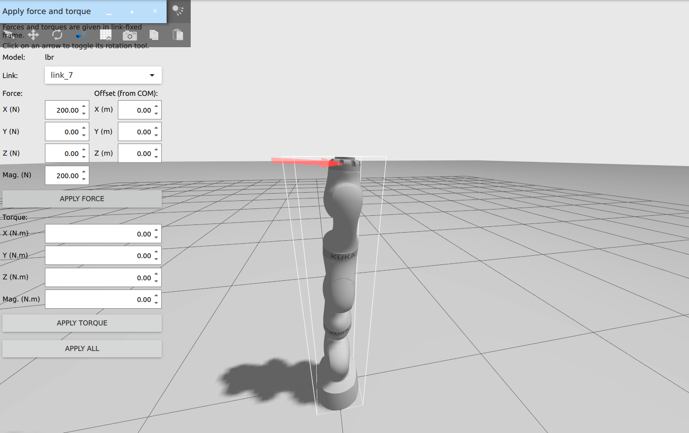

## Gravity Compensation - ROS 2 Control with Modern Gazebo

Disclaimer: This repository is simply a snapshot from Dentaqt project for demonstration purpose. As the project owner, I am allowed to share this part of the code without any liabilities.

## Installing Dependencies - Manual Installation

We will be installing and running the software on a **Ubuntu 22.04 (Jammy Jellyfish)** distribution of Linux. Currently support for Windows or Mac is not available.

### Overview

| Package            | Version                      | License    | EOL/Support                                                  |
| ------------------ | ---------------------------- | ---------- | ------------------------------------------------------------ |
| ROS 2              | Humble                       | Apache-2.0 | May 2027                                                     |
| Gazebo Sim         | Fortress                     | Apache-2.0 | Sep 2026                                                     |
| LBR FRI ROS2 Stack | `dev-humble-ignition-gazebo` |            | Early Adoption - Still not released, Supports Gazebo Fortress, used with fri-1.16 |
| FRI Client         | **(B)** fri-1.16             | Apache-2.0 | Works with Gazebo Fortress and `dev-humble-ignition-gazebo`, while fri-2.5 throws some compilation errors due to API changes |
| Pinocchio          | 2.7.0                        | BSD-2      | Released Jan 2024                                            |

### ROS 2 and Gazebo

- Install binaries of [ROS 2 Humble](https://docs.ros.org/en/humble/Releases/Release-Humble-Hawksbill.html) [EOL May 2027] (Desktop Install `ros-humble-desktop` and Development tools `ros-dev-tools`) according to the instructions [here](https://docs.ros.org/en/humble/Installation/Ubuntu-Install-Debians.html).
- Install binaries of [Gazebo Fortress](https://gazebosim.org/docs/fortress/install) [EOL 2026 Sep] following the instructions [here](https://gazebosim.org/docs/fortress/install_ubuntu).

- Also check if rosdev tools and additional packages that exists,(Note: these are available in gazebo installations, especially building from source) otherwise install,

```
sudo apt install python3-pip wget lsb-release gnupg curl
pip install vcstool || pip3 install vcstool
pip install -U colcon-common-extensions || pip3 install -U colcon-common-extensions
sudo apt-get install git
sudo apt install ros-dev-tools
```

- Check if Ign-ros2-control package exists, otherwise install,

```
sudo apt install ros-humble-ign-ros2-control
```

> P.S. do not forget to add `source /opt/ros/humble/setup.bash` to your `.bashrc` file.

Create a dedicated work space to install rest of the dependencies and software,

```sh
mkdir -p kuka25_ws/src
cd kuka25_ws
```

### LBR FRI ROS 2 Stack

Note that installing `lbr_fri_ros2_stack` will directly clone `fri_vendor` package (nested with `fri` SDK) as external projects.

```sh
vcs import src --input https://raw.githubusercontent.com/lbr-stack/lbr_fri_ros2_stack/humble/lbr_fri_ros2_stack/repos.yaml
rosdep install --from-paths src -i -r -y
```

This will install all the necessary dependencies required to run the LBR FRI ROS 2 stack.

#### Support for ROS 2 Humble and Gazebo Fortress

Since we will be using Gazebo Fortress (which was still named as Ignition), we need to launch `ign_ros2_control` (later versions renamed as `gz_ros2_control`). Launching the LBR FRI ROS 2 Stack with Gazebo Fortress is still not merged and released as a major version, since the pull request https://github.com/lbr-stack/lbr_fri_ros2_stack/pull/117 is still under review. As an early adoption, we may checkout the `dev-humble-ignition-gazebo` branch in `lbr_fri_ros2_stack` package,

```sh
cd kuka25_ws/src/lbr_fri_ros2_stack
git checkout dev-humble-ignition-gazebo
cd ../../ # go to kuka25_ws
colcon build --symlink-install --cmake-args -DFRI_CLIENT_VERSION=1.16 --no-warn-unused-cli
source install/setup.bash
```

Verify by Launching the robot to ensure the environment is setup properly,

```sh
ros2 launch lbr_bringup bringup.launch.py \
    model:=med7 # [iiwa7, iiwa14, med7, med14] \
    sim:=true # [true, false] \
    rviz:=true # [true, false] \
    moveit:=true # [true, false]
```

Add `source <path-to-kuka25_ws>/install/setup.bash` to `.bashrc`

### Pinocchio 

- Add `robotpkg apt` repository

  ```sh
  sudo mkdir -p /etc/apt/keyrings

  curl http://robotpkg.openrobots.org/packages/debian/robotpkg.asc \
       | sudo tee /etc/apt/keyrings/robotpkg.asc

  echo "deb [arch=amd64 signed-by=/etc/apt/keyrings/robotpkg.asc] http://robotpkg.openrobots.org/packages/debian/pub $(lsb_release -cs) robotpkg" \
       | sudo tee /etc/apt/sources.list.d/robotpkg.list

  sudo apt update
  ```

- Install `pinocchio` (used) and `tsid` (currently unused)

  ```sh
  sudo apt install -qqy robotpkg-py3*-pinocchio robotpkg-py3*-eigenpy
  ```

- Update environment variables by copy-pasting the following lines in `.bashrc`
  ```sh
  export PATH=/opt/openrobots/bin:$PATH
  export PKG_CONFIG_PATH=/opt/openrobots/lib/pkgconfig:$PKG_CONFIG_PATH
  export LD_LIBRARY_PATH=/opt/openrobots/lib:$LD_LIBRARY_PATH
  export PYTHONPATH=/opt/openrobots/lib/python3.10/site-packages:$PYTHONPATH # Adapt your desired python version here
  export CMAKE_PREFIX_PATH=/opt/openrobots:$CMAKE_PREFIX_PATH
  ```


## Installing Dependencies - Docker Image

Currently not implemented.

## Usage

Clone the repository in `kuka25_ws/src` and build from `kuka25_ws`, 
```sh
colcon build --symlink-install --cmake-args -DFRI_CLIENT_VERSION=1.16 --no-warn-unused-cli
```
We already updated the environment variable to source the workspace in the above section. Simply open a new terminal and launch
```sh
ros2 launch dentaqt_controllers lbr.gravity_compensation.launch.py 
```


Gazebo window will open with the robot in the simulation world and we may use the apply force-torque plugin to exert external wrenches on the robot and 
observe the gravity compensated behaviour.

## Troubleshooting

- Graphics driver error while running Gazebo,

  > X Error of failed request: BadValue (integer parameter out of range for operation)
  > Major opcode of failed request: 152 (GLX)
  > Minor opcode of failed request: 3 (X_GLXCreateContext)
  > Value in failed request: 0x0
  > Serial number of failed request: 23
  > Current serial number in output stream: 24

  - Try restarting the computer (if recently updated NVIDIA drivers)

## References

- Huber, Martin, et al. "**Lbr-stack: Ros 2 and python integration of kuka fri for med and iiwa robots.**" _arXiv preprint arXiv:2311.12709_ (2023).
- [Pinocchio Installation Procedure](https://stack-of-tasks.github.io/pinocchio/download.html)
